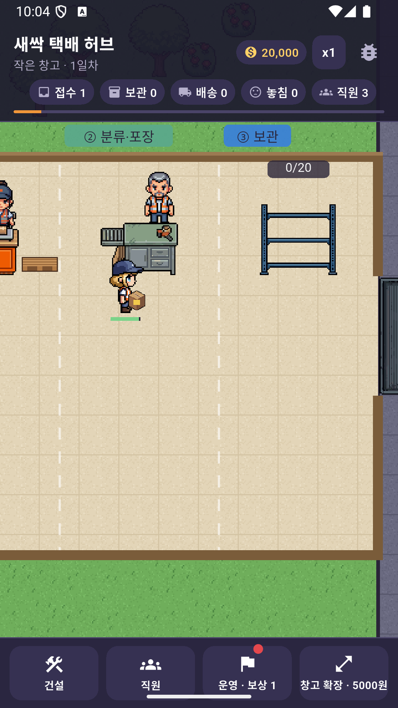
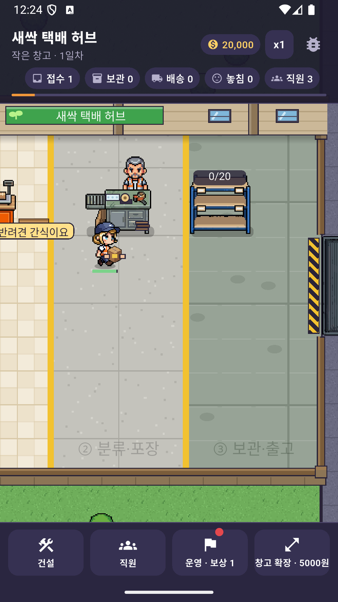
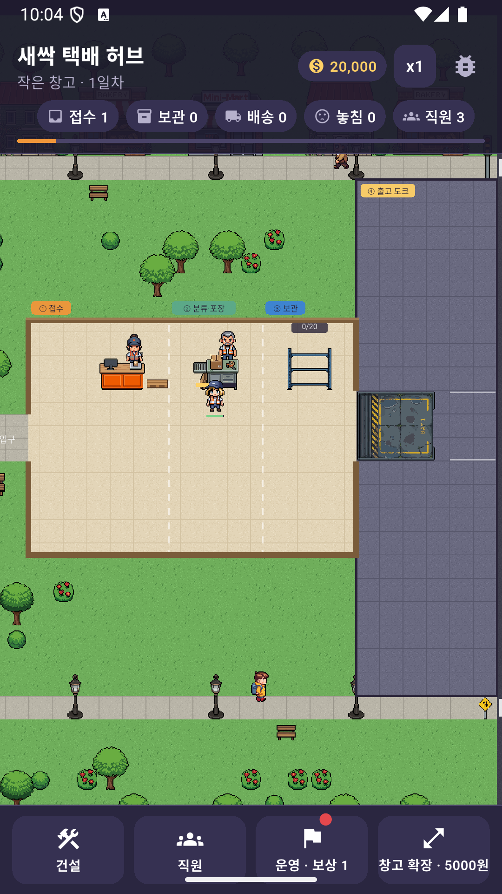
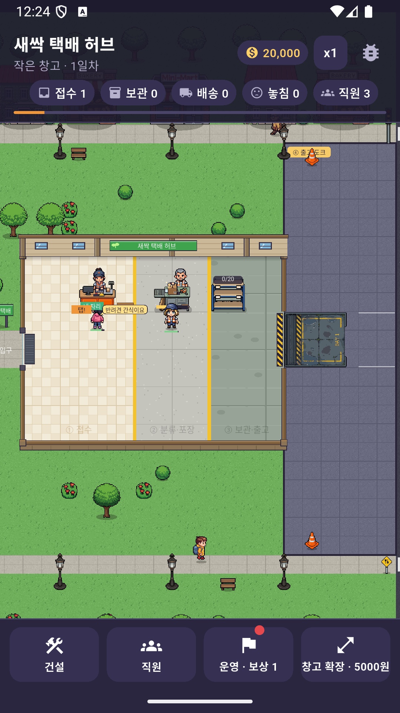

# 허브 개편 (2026-10-09)

## 개편 전 문제 (에뮬레이터 스크린샷 기준)
1. 구역이 파스텔 색칠한 직사각형 + 글자뿐이라 건물로 보이지 않음.
2. 그림 크기·시점이 제각각: 창구(비스듬), 포장대(다리 보이는 정면), 선반(정면), 직원(56px)이 창구보다 큼.
3. 겹침: 그림이 칸보다 위로 넘쳐 위쪽 칸·건물과 겹침, 창구 직원이 칸 바깥 윗줄에 섬, 선반 수량 글자가 상자·막대와 겹침.
4. 도크는 남색 사각형 + 글자, 트럭이 도크 칸보다 커서 삐져나감.
5. 도크 마당이 10x22칸 빈 회색 바닥.
6. 동선이 안 보임: 입구 → 접수 → 포장 → 선반 → 도크 순서가 바닥에 표시되지 않고 직원이 아무 데로나 가로지름.

## 개편 후 구조
- 한 방향 동선: 입구(왼쪽 벽) → ① 접수 → ② 분류·포장 → ③ 보관 → ④ 출고 도크(오른쪽 벽 밖).
  (2차 개선 후) 미리 깔린 통로는 없고, 유저가 통로를 직접 깐다 — 아래 '2차 개선' 참고.
- 구역은 색판 대신 바닥 흰 점선 경계 + 창고 윗벽 바깥 번호 간판. 배치 중에만 들어갈 구역을 진하게 표시.
- 벽 두께 8px, 입구(통로 자리)와 도크 문은 뚫려 있음.
- 도크 마당은 6칸 폭(도크 4 + 드나드는 2)으로 줄이고 도크마다 주차칸 선. 도로는 그 오른쪽.

## 격자·크기 규칙
- 1칸 = 32px, 모든 허브 그림은 같은 시점(내려다보기 3/4)·같은 배율(도트 1px = 1칸의 1/32), 칸보다 크게 키우지 않는다.
- 그림은 자기 칸(footprint) 안에 비율 유지 + 바닥 맞춤으로 그린다 (`Sprites.drawFitBottom`). 위로 넘치지 않는다.
- 크기: 접수 창구 3x2(왼쪽 2칸 책상, 오른쪽 1칸 상자 적재대), 분류·포장대 2x2, 선반 2x2, 휴게실 3x3, 자판기 1x1, 도크 4x3(벽에 붙음).
- 배치 금지: 유저가 깐 통로 위, 양쪽 문 바로 안쪽 칸, 다른 건물의 앞줄(바로 아래 한 줄 = 손님 줄·직원 서는 자리), 내 앞줄이 막히는 자리.
- 직원은 책상 그림 뒤에 서고, 발끝 y 정렬로 책상이 나중에 그려져 다리를 가린다 (`_spots`, `_deskBack`).

## 에셋 (PixelLab)
- 접수 창구를 먼저 만들고, 그 그림을 스타일 참조(style_images)로 넘겨 포장대·선반·휴게실을 같은 화풍으로 만듦.
- 도크는 1차가 비스듬한 등각 시점이라 프롬프트를 '정면 위에서, 원근 없음'으로 고쳐 2차에 채택.
- 바닥: 콘크리트 / 노란 통로 Wang 타일셋 (`assets/sprites/tiles/wang_floor.png`).
- 파일: `assets/sprites/props/hub_counter|hub_pack|hub_shelf|hub_lounge|hub_dock.png`, 원본 후보는 `assets/raw/pixellab/hub_*`.

## 2차 개선 (2026-10-09)
1. 접수 창구 오른쪽 칸 = 나무 팔레트 적재대. 상자를 2열씩 아래 층부터 최대 4층까지 쌓고(`Cfg.stackCols/stackLayers`),
   운반 직원은 맨 위 상자부터 집어 간다(급송은 먼저). 늘고 줄 때 맨 위 상자가 떠오르며 생기고 사라짐.
2. 손님 사연 말풍선(`Cfg.stories`, 39종, 지역·성수기 전용 포함). 머리 오른쪽에 떠서 줄 선 손님끼리 겹치지 않는다.
   탭하면 미리 처리(접수 2배 빠름, 인내심 감소 절반) + 팁/만족/명성. 접수량에는 영향 없음.
3. 접수량: 시작 분당 1.5건, 손님 1~2명씩 도착, 접수 12초, 인내심 60초, 적재대 6칸 (`tools/sim/econ_sim.py`).
4. 허브 도로 배경 차량: `road_car|van|moto.png` (위에서 본 세로 차체, 운전자 보임). 시간만으로 위치를 정하고 화면 밖은 건너뜀.
5. 도크 트럭: `dock_truck.png` / `dock_truck_full.png` (도크 그림을 스타일 참조, 같은 오브젝트의 두 상태).
   실은 만큼 짐칸을 운전석 쪽부터 짐 실은 그림으로 채운다.
6. 직원 서는 자리: 그림별 발 위치·가림 높이(`_deskBack`). 포장대는 책상 뒤 끝에 서고 책상 전체를 앞에 다시 그림.
   휴게실 자리는 소파 방석 2곳 + 탁자 양옆 바닥 2곳.
7. 선반: 정면·대칭 `hub_shelf.png`(62x57), 판 윗면 y=47/27/7에 상자.
8. 통로: 건설 메뉴 맨 위 '통로'. 깔기/철거/화면 이동 도구로 드래그, 칸당 30원(철거 시 절반 환불), 창고 안에만.
   통로 위 1.5배·밖 0.8배로 걷고(`Cfg.aisleFast/aisleSlow`), 직원은 칸 격자에서 걸리는 시간이 가장 짧은 길을 찾는다
   (`lib/systems/path_system.dart`, 건물은 피하고 오른쪽 벽은 문으로만). 도크 적재 자리는 창고 안 도크 문 앞.
   통로 모드에서 최근 동선을 주황으로 강조하고, 최근 걸음 중 통로 위 비율을 보여 준다.

## 3차 개선 (2026-10-09, 실기기 피드백)
작업 전 / 후 (같은 구도: 새 게임 + 시작 구성 자동 배치 20초 뒤, 기본 줌과 최소 줌)

| 작업 전 | 작업 후 |
|---|---|
|  |  |
|  |  |

- A 하단 UI: 하단 메뉴·확인 바·시트·노선 지도 버튼에 `navInset()`(MediaQuery viewPadding/padding 중 큰 값) 적용.
  제스처 내비게이션·3버튼 내비게이션 둘 다 에뮬레이터에서 확인. 상단은 기존대로 padding.top.
- B 직원 배치: 시작 직원 3명은 모두 휴식 벤치 앞에서 대기(운반 담당도 없음). 건설해도 자동 배치하지 않는다.
  시설을 탭하면 시트에 직원 목록이 바로 떠서 고르면 배치, 또는 대기 직원을 먼저 탭하고 시설을 탭(선반·도크 = 운반 담당).
  직원이 없는 시설은 깜빡이는 '직원 없음', 튜토리얼은 '① 접수 창구에 직원을 배치하세요'.
- C 진행경로: 노란 화살표는 이미 없었고, 흰 점선은 구역 경계를 그리기만 하던 장식이라(로직은 `zoneRect`만 씀) 삭제.
  구역(건설 위치 제한)은 그대로 두고, 바닥 재질·색·바닥 글씨로 표시한다. 이동 통로는 유저가 직접 까는 통로로 대체(2차 8번).
- D 그리기 순서: 외벽·나무·가로등·시설·사람을 발끝 y로 정렬해 그리고(`_at`), 말풍선·수량표는 맨 위(`_tag`).
  가로등은 걷는 길 옆 풀밭으로 옮기고, 장식이 선 칸은 길찾기에서 막음(`Scenery.solid`). 접수·포장 직원은 책상 뒤에 선다.
- E 시점 통일: 선반을 탑뷰 3/4(윗판이 위에서 보이고 앞면, 좌우 대칭, 비스듬하지 않음)로 다시 만듦.
  PixelLab 2회(1차는 왼쪽 옆면이 보여 탈락, 2차 `view: top-down` + 접수대 참조로 채택). 선반은 2x2로 줄임.
- F 간격: 건설 시작 위치를 앞 단계 시설(접수 → 포장 → 선반) 오른쪽 1칸 띄운 자리로 추천(`_suggestSpot`),
  같은 종류는 그 아래(앞줄 1칸 띄움). 디버그 시작 구성도 시설 사이 1칸.
- G 퀄리티 체크리스트 (화면으로 확인)
  - [x] 1 건물 구조: 북쪽 외벽(판넬·기둥·창문·'새싹 택배 허브' 간판), 옆벽·남쪽 벽 앞면, 모서리 기둥, 입구 문틀·발판, 입구 간판 '새싹 택배'
  - [x] 2 구역별 바닥: 접수 밝은 타일, 포장 콘크리트 + 노란 안전선, 보관·출고 공장 바닥(에폭시·판넬 줄눈) (`floor_view.dart`)
  - [x] 3 시설 소품: 접수대 컴퓨터·저울(그림) + 스탬프·벨, 포장대 테이프·뽁뽁이·접은 상자 더미, 선반 라벨판(그림) + 높이가 다른 상자, 도크 롤업 도어(그림) + 바닥 경고 줄무늬
  - [x] 4 그림자: 시설·직원·손님·행인·나무·가로등 밑 바닥 그림자
  - [x] 5 작업 애니메이션: 접수 키보드 두드리는 손, 포장 테이프 건 왕복, 운반 두 손으로 상자 들기 + 걸음 들썩임
  - [x] 6 외곽선·팔레트: 코드로 그리는 것은 모두 `ink`(0xFF2A2438) 1px 외곽선, 색은 `Pal`(에셋 톤에서 뽑음) (`structure_view.dart`)
  - [x] 7 PixelLab: 선반 1건에만 사용(2회, 20크레딧). 나머지는 코드로 그림.
